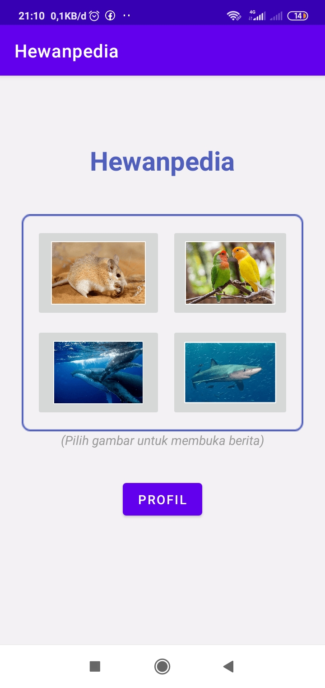

<h1 id="about" align="center">Hewanpedia</h1>

<div align="center">
    
</div>

<br>

<p align="center">Hewanpedia merupakan sebuah Aplikasi Mobile yang menampilkan informasi seputar Hewan mulai dari nama, asal atau daerah penyebarannya serta deskripsi lengkap dari hewan tersebut. Project ini dibuat untuk memenuhi salah satu tugas Mata Kuliah Pemrograman Mobile.</p>

<br>

## Dibangun Menggunakan
* Java
* Android Studio

## Instalasi
* clone repo
```sh
git clone https://github.com/ekialfani/hewanpedia
```  
* jalankan menggunakan android studio
